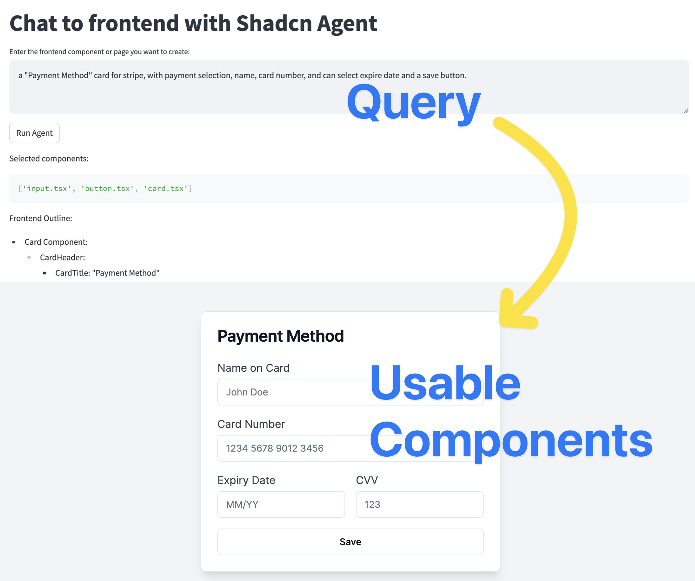

# Chat to Frontend Using Shadcn Agent

使用Shadcn或者各种组件库的时候，总是需要查看很多代码example。为什么不让GPT主动看了这些example写出一个前端组件库呢？

本Repo想展示使用langgraph的四步骤流程，使用shadcn官方文档构建Shadcn Agent

实现完全自动化的组件生产。

## Usage

rememeber to copy .env_template to .env and replace your api key.

`pip install -r requirements.txt`

`streamlit run webui.py`

## Data Processing

其实大部分的实验都是在于如何处理数据，就是召回shadcn官方文档的数据。这个部分在`data/`中。

我还探索了使用Dspy进行原型搭建。

## Agent

使用Langgraph进行链路搭建，推荐使用langsmith进行检测！

我感觉prompt影响非常大！